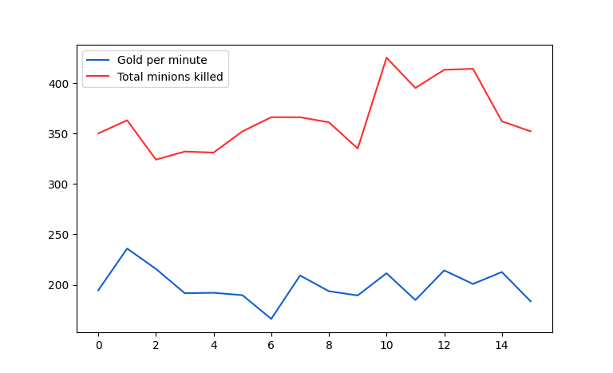

15-min-gamba
# Data science project based on League of Legends
In the project, I decided to build and train a neural network classifier.

## Table of Content
- [Project Object](#project-object)
- [Introduction](#introduction)
- [Collecting the Data](#collecting-the-data)
- [The Match Data](#the-match-data)
- [Data Cleaning](#data-cleaning)
- [Exploratory Data Analysis](#exploratory-data-analysis)
- [Feature Engineering](#feature-engineering)
- [Possible Multicollinearity](#possible-multicollinearity)
- [Bulding the Model](#building-the-model)
- [Evaluation](#evaluation)
- [Review](#review)

## Project Object

The goal of the project is to effectively predict the outcome of a League of Legends game based on the state of the game at the 15 minutes mark.

## Introduction
League of Legends (LoL) is a highly popular online multiplayer battle arena video game developed and published by Riot Games. It's a free-to-play game that was first released in 2009, and since then, it has become one of the most prominent and influential games in the esports industry.

In League of Legends, players assume the role of a "champion," each with their own unique abilities and playstyles, and are placed into teams of typically five players. The objective varies depending on the game mode, but generally involves destroying the opposing team's Nexus, a structure located within their base. Players must navigate through various lanes and engage in strategic battles with both computer-controlled minions and enemy champions to achieve victory.

One of the key aspects of League of Legends is its strategic depth and complexity. Matches require teamwork, coordination, and skillful execution of individual abilities and tactics. The game also features a constantly evolving meta-game, with frequent updates, balance changes, and new champions being introduced to keep the gameplay fresh and engaging.

## Collecting the Data
In my project I used data from 1000 best players. But why? Simply because good players and extremely good players are making way less mistakes. This means that if they get a lead they are less likely to make risky decision which may result in throwing the winning position they managed to acquire.

All the data I collected was obtained using the Riot Games [API's](https://developer.riotgames.com/apis). They offer a wide range of endpoints that you can use together with the documentation.

However, Riot Games has the following API access rates limits:
- 20 requests every 1 second
- 100 requests every 2 minutes

### Process of coleccting data

The first step was acquiring the encrypted summoner id's. I could get that by using the 'LEAGUE-EXP-V4' endpoint (specifically, /lol/league-exp/v4/entries/{queue}/{tier}/{division}). Providing the type of queue, rank, and number of pages I could get a list containing id's mentioned earlier. I chose to get id's of a **1000** best players from EUNE (Europe Nordic East) server. Precisely I got **200** CHALLENGER, **500** GRANDMASTER and **300** MASTER rank players.

The second step was to convert my **1000** summoner id's into PUUID's, which are another type of ID, this time used to connect players to the game. I managed to do this using the 'SUMMONER-V4' endpoint (specifically, /lol/summoner/v4/summoners/{encryptedSummonerId}), which after sending the summoner id returned the corresponding PUUID.

Now for each player, with the help of the already acquired PUUID I had to acquire his history of ranked games . The ones on which he was classified. To do this, a 'MATCH-V5' endpoint was needed. (specifically, /lol/match/v5/matches/by-puuid/{puuid}/ids) After entering a player's PUUID, it returned his game history in the form of id's of his **100** most recently played ranked games. (**100** was the limit for each player) The process resulted in me getting **100 000** game id's played by the best players on the server.

However, as you can guess, since these are the best players, they play with each other. After checking and removing duplicate game id's. From **100 000** game id's, I was left with only **42172** left (**58.8%** of data was removed}).

### Summarisation:
- I used my self-gathered data
- I got the data with Riot Game's API using different endpoints
- I used 100 games per player out of 1000 player base
- I ended up with around 42 000 match entries in my data set

## The Match Data

This section is about designind the data frame.

When querying a match with a timeline with the average game duration (which was around **28.1** minutes on EUNE server), the returning JSON file included about **37k** (thirty-seven thousand) lines, which was way too much to put in this README.
Therefore, I decided to display a simplified 'pseudo'-version of it for you to be able to follow up:

    metadata
        match id
        participants
    info
        event
            event type
            timestamp
            additional event info
        stats
            player 1
            player 2
            ...
            player 10
            timestamp
        event
            event type
            timestamp
            additional event info
        stats
            player 1
            player 2
            ...
            player 10
            timestamp
        ...

Note that there was a new 'event' and 'stats' entries every minute. That means, including the 0th minute, there were 1 + 28 'event'/'stats' entries in a match with a duration of 28 minutes.
I focused on only the 'stats' at the 15-minute timestamp since that includes the values I want.

The timestamps are in milliseconds and sadly there is not always the same timestamp at the exactly 15-minute mark.
An example was game when timestamp occured at **900207** miliseconds, which was around **15.00345** minutes.
I couldn't look at a decent amount of games to be able to confidently define the average of the 15-minute timestamp, so I used 900000-901000 milliseconds (or 15-15,0166667 minutes).
Here is an example of the 'stats' of one player at a certain timestamp:

    "1": {
        "championStats": {
            "abilityHaste": 0,
            "abilityPower": 0,
            "armor": 42,
            "armorPen": 0,
            "armorPenPercent": 0,
            "attackDamage": 73,
            "attackSpeed": 127,
            "bonusArmorPenPercent": 0,
            "bonusMagicPenPercent": 0,
            "ccReduction": 5,
            "cooldownReduction": 0,
            "health": 685,
            "healthMax": 685,
            "healthRegen": 17,
            "lifesteal": 0,
            "magicPen": 0,
            "magicPenPercent": 0,
            "magicResist": 32,
            "movementSpeed": 350,
            "omnivamp": 0,
            "physicalVamp": 0,
            "power": 339,
            "powerMax": 339,
            "powerRegen": 15,
            "spellVamp": 0
        },
        "currentGold": 98,
        "damageStats": {
            "magicDamageDone": 0,
            "magicDamageDoneToChampions": 0,
            "magicDamageTaken": 0,
            "physicalDamageDone": 440,
            "physicalDamageDoneToChampions": 0,
            "physicalDamageTaken": 0,
            "totalDamageDone": 440,
            "totalDamageDoneToChampions": 0,
            "totalDamageTaken": 0,
            "trueDamageDone": 0,
            "trueDamageDoneToChampions": 0,
            "trueDamageTaken": 0
        },
        "goldPerSecond": 0,
        "jungleMinionsKilled": 0,
        "level": 1,
        "minionsKilled": 4,
        "participantId": 1,
        "position": {
            "x": 2206,
            "y": 12847
        },
        "timeEnemySpentControlled": 0,
        "totalGold": 598,
        "xp": 211
    }
Here is the list of data I wanted to gather:

| **Value**                | **Explanation**                                                                    | **Where/How to get**                                                                        |
|--------------------------|------------------------------------------------------------------------------------|---------------------------------------------------------------------------------------------|
| win                      | Which team did win                                                                 | 'GAME_END'-event                                                                            |
| wardsPlaced              | A ward provides vision and might prevent death                                     | Iterate over each 'WARD_PLACED'-event and add up                                            |
| wardsDestroyed           |                                                                                    | Iterate over each 'WARD_KILL'-event and add up                                              |
| firstBlood               | The first kill in a game provides extra gold                                       | 'killType': 'KILL_FIRST_BLOOD'                                                              |
| kills                    | Provides gold and experience and prevents enemy from gathering gold and experience | Iterate over each 'type': 'CHAMPION_KILL' and add for each 'killerID'                       |
| deaths                   |                                                                                    | Iterate over each 'type': 'CHAMPION_KILL' and add for each 'victimID'                       |
| assists                  | Provides a tiny bit of gold and experience                                         | Iterate over each 'type': 'CHAMPION_KILL' and add 'assistingParticipantIds'                 |
| dragons                  | Provides team-wide buff, gold and experience                                       | Iterate over each 'monsterType': 'DRAGON' and read 'killerTeamId'                           |
| heralds                  | Once killed, a herald can be placed to destroy buildings                           | Iterade over each 'monsterType': 'RIFTHERALD' and read 'killerTeamId'                       |
| voidGrubsKilled          | Once killed, increases the damege dealt to towers                                  | Iterate over each 'monsterType': 'HORDE' and read 'killerTeamId'                            |
| towersDestroyed          | Provides gold, opens the map                                                       | Iterate over each 'type': 'BUILDING_KILL' where 'buildingType': 'TOWER_BUILDING'            |
| totalGold                | Gold is required to purchase items                                                 | Read 'totalGold' from 'stats' per player                                                    |
| avgLevel                 | Player get better stats when advancing to the next level                           | Read 'level' for each summoner and divide by 5                                              |
| totalMinionsKilled       | Minions provide gold and experience                                                | Read 'minionsKilled' and add up for each player                                             |
| totalJungleMonsterKilled | Jungle monster provide gold and experience                                         | Read 'jungleMinionsKilled' and add up for each player                                       |
| csPerMinute              | Amount of minions killed per minute                                                | Add totalMinionsKilled for each player, divide by 5, divide by 15                           |
| goldPerMinute            | Amount of gold acquired per minute                                                 | Read 'goldPerSecond' for each player, add up and divide by 5                                |
| gameDuration             |                                                                                    | 'GAME_END'-event                                                                            |

The table below shows my variables and their data types:

| **Variable**                     | **Datatype** |
|----------------------------------|--------------|
| blueTeamWin                      | integer      |
| blueTeamWardsPlaced              | float        |
| blueTeamWardsDestroyed           | float        |
| blueTeamFirstBlood               | integer      |
| blueTeamKills                    | integer      |
| blueTeamDeaths                   | integer      |
| blueTeamAssists                  | integer      |
| blueTeamDragons                  | integer      |
| blueTeamVoidGrubsKilled          | intefer      |
| blueTeamHeralds                  | integer      |
| blueTeamTowerDestroyed           | integer      |
| blueTeamTotalGold                | integer      |
| blueTeamAvgLevel                 | float        |
| blueTeamTotalMinionsKilled       | integer      |  
| blueTeamTotalJungleMonsterKilled | integer      |
| blueTeamCsPerMinute              | float        |
| blueTeamGoldPerMinute            | float        |
| gameDuration (in seconds)        | integer      |

Please note, there were the same variables for the red team as well (excluding gameDuration obviously).
blueTeamWin was numeric value: 1 for True and 0 for False, to simplify the handling in the dataframe later.
Collected raw data was stored originally in .csv file.

The last step was saving the raw match data I got.
Now there are different ways of storing dataframes. The direct comparison shows [feather](https://arrow.apache.org/docs/python/feather.html) to be the optimal storage file-format:

([Source](https://towardsdatascience.com/the-best-format-to-save-pandas-data-414dca023e0d))

## Data Cleaning

There was only one types of falsy data I had to sort out:
- falsy data returned by the Riot Games API

Falsy data returned by the Riot Games API was marked by having a '2' in both, blueTeamWin and readTeamWin, to easily sort them out.
I got rid of these lines by doing:

    df = df[df.blueTeamWin != 2]

resulting in **41 282** (fourty-one-thousand two-hundred and eighty-two) matches left in my data.

## Exploratory Data Analysis

In this chapter I want to explore my data, I want to take a look at the main characteristics and compare certain values.

The very first thing to show is of course the win rate for each team:

The actual win rate overall in EUNE Server for the **MASTER+** blue team is 48.5 % as of [League Of Graphs](https://www.leagueofgraphs.com/pl/stats/blue-vs-red/eune/master) in the current patch as of writing this (14.11).
The difference-maker was the fact that **MASTER+** means that we took **CHALLANGER**, **GRANDMASTER**, and **ALL** **MASTER** players.
**MASTER** tier has currently around **15 000** players. 

You can also take a look at the team's win rate depending on having first blood:

The blue team seems to better at winning games when playing from behind while the red team should prefer building an advantage in the early stage of the game.

    Sidenote:
    When a champion or a team has less gold, experience or stats than the opponent,
    they are playing from 'behind'.

Another thing I wanted to show is the correlation between the gold and cs per minute:

Out of appearance reasons I only used the data from the blue team if they win and the game duration is over 2.500 (two-thousand five-hundred) seconds.
Note, that the gold per minute value *should* be higher than the cs per minute value. I divided the gold per minute value by 10 for appearance.  
Cs'ing is not the only source of gold income, but it obviously takes a great part of it.

    Sidenote:
    'Cs-ing' describes the procedure of farming minions.

But I am sure the most interesting view is a heatmap:

The labels on the x-axis are a bit off, I couldn't find a way to fix this. Please orientate on the y-axis.
These are the values from the blue team, excluding the game duration.

This view is the best to show correlations for variables.
I can for example see that the assists and kills are strongly positively correlated, which wasn't really a surprise.
So is the amount of total minions killed and the cs per minute.

## Feature Engineering

This chapter covers the creation of variables which were most likely having the biggest impact of the probability of winning.
This also is where I divided my testing, validation and training data from my whole data set.

I will start off with separating my data:

    import pandas as pd

    df = pd.read_feather('data-final/data.feather')

    df_train_val = df2.sample(frac=0.9, random_state=777)
    df_test = df2.drop(df_train_val.index)

    df_val = df_train_val.sample(frac=0.15, random_state=777)
    df_train = df_train_val.drop(df_val.index)

My training data consisted of 75 % of the whole data set, while the validation data took 15% and the last 10% belonged to testing data.

After that, I added variables to simplify my model for later learning purposes:

| **Variable**                    | **Calculation**                                                                  |
|---------------------------------|----------------------------------------------------------------------------------|
| blueTeamWardRetentionRatio      | (blueTeamWardsPlaced - redTeamWardsDestroyed) / blueTeanWardsPlaced              |
| redTeamWardRetentionRatio       | -1 * (redTeamWardsPlaced - blueTeamWardsDestroyed) / redTeamWardsPlaced          |
| blueTeamNetKills                | blueTeamKills - redTeamKills                                                     |
| blueTeamTeamworkGradeDiff       | (df.blueTeamAssists * df.blueTeamKills) - (df.redTeamAssists * df.redTeamKills)  |
| blueTeamJungleMonstersKilledDiff | blueTeamTotalJungleMinionsKilled - redTeamTotalJungleMinionsKilled              |
| blueTeamMinionsKilledDiff       | blueTeamTotalMinionsKilled - redTeamTotalMinionsKilled                           |
| blueTeamAvgLevelDiff            | blueTeamAvgLevel - redTeamAvgLevel                                               |
| blueTeamCsPerMinuteDiff         | blueTeamCsPerMinute - redTeamCsPerMinute                                         |
| blueTeamGoldPerMinuteDiff       | blueTeamGoldPerMinute - redTeamGoldPerMinute                                     |
| blueTeamTowersDestroyedDiff     | blueTeamTowersDestroyed - redTeamTowersDestroyed                                 |
| blueTeamDragonsKilledDiff       | blueTeamDragonsKilled - redTeamDragonsKlled                                      |
| blueTeamHeraldsKilledDiff       | blueTeamHeraldsKilled - redTeamHeraldsKlled                                      |
| blueTeamVoidGrubsKilledDiff     | blueTeamVoidGrubsKilled - redTeamVoidGrubsKilled                                 |
| blueTeamWin                     | blueTeamWin                                                                      |

Note that I only need these variables for one team (in this case blue team), since red team wins if blue team does not.

I added these variables simply by doing:

    df2['blueTeamWardRetentionRatio'] = (df.blueTeamWardsPlaced - df.redTeamWardsDestroyed)/df.blueTeamWardsPlaced
    df2['redTeamWardRetentionRatio'] = -1 * (df.redTeamWardsPlaced - df.blueTeamWardsDestroyed)/df.redTeamWardsPlaced
    df2['blueTeamNetKills'] = (df.blueTeamKills - df.redTeamKills)
    df2['blueTeamTeamWorkGradeDiff'] = (df.blueTeamAssists * df.blueTeamKills) - (df.redTeamAssists * df.redTeamKills)
    df2['blueTeamJungleMonstersKilledDiff'] = (df.blueTeamTotalJungleMonstersKilled - df.redTeamTotalJungleMonstersKilled)
    df2['blueTeamMinionsKilledDiff'] = (df.blueTeamTotalMinionsKilled - df.redTeamTotalMinionsKilled)
    df2['blueTeamAvgLevelDiff'] = (df.blueTeamAvgLevel - df.redTeamAvgLevel)
    df2['blueTeamCsPerMinuteDiff'] = (df.blueTeamCsPerMinute - df.redTeamCsPerMinute)
    df2['blueTeamGoldPerMinuteDiff'] = (df.blueTeamGoldPerMinute - df.redTeamGoldPerMinute)
    df2['blueTeamTowersDestroyedDiff'] = (df.blueTeamTowersDestroyed - df.redTeamTowersDestroyed)
    df2['blueTeamDragonsKilledDiff'] = (df.blueTeamDragonsKilled - df.redTeamDragonsKilled)
    df2['blueTeamHeraldsKilledDiff'] = (df.blueTeamHeraldsKilled - df.redTeamHeraldsKilled)
    df2['blueTeamVoidGrubsKilledDiff'] = (df.blueTeamVoidGrubsKilled - df.redTeamVoidGrubsKilled)
    df2['blueTeamWin'] = df.blueTeamWin
## Possible Multicollinearity

Multicollinearity describes the issue with multiple variables correlating when predicting the same outcome.

Say the blue team got first blood, have lots of early-game-champions in their team, decent player and an understanding of extending the advantage they acquired.
Now surely the blue team will have more options to actively control the game. That results in blue team having more gold and experience.
If the blue team now wins the game, it's not easy to say which factors (for example gold or experience) had more impact to that.

    Sidenote:
    A match can be classified in three stages: early-, mid- or late-game.
    An 'early-game-champion' performs well in the earlier stage of the game,
    while a late-game-champion often suffers early on against early-game-champions.

A simple example (with barely any matches to be able to visualise the problem):

Values were unified for appearance reasons.

As seen in the plot, the two values did correlate quiet often.
Now I couldn't tell which value induced the other as both seemed to be valuable yet similar.

I decided to tweak the values later if I wasn't satisfied with the results.

## Building the Model

I chose Sequential model, because it is appropriate for a plain stack of layers where each layer has exactly one input tensor and one output tensor.

    model = Sequential()

Now the question was how large I wanted my neural network to be.
I knew my neural network needed to have Input layer with the size of input being set as 14.

    input_layer = Input(shape=(13,))
    model.add(norm_layer)

The next important layer was Normalization Layer.

    norm_layer = Normalization()
    norm_layer.adapt(dataset_train_values)
    model.add(norm_layer)
    
The interesting part was the number of hidden layers.
As of [this]('https://kharshit.github.io/blog/2018/04/27/how-deep-should-neual-nets-be') source, I start of with three hidden layers with 9 neurons each.

Next up I needed some kind of prevention against overfitting.
I achieved this by adding acticity regularization on specific layers.
I did this by simply adding the 'activity_regularizer' parameter to the layer.
I chose L2 activity regularization function. But why?

L2 regularization is used to prevent overfitting in machine learning models by penalizing large parameter values. It encourages the model to learn simpler patterns by adding a penalty term to the loss function proportional to the square of the magnitude of the parameters. By controlling the complexity of the model through regularization, L2 regularization helps improve its ability to generalize to new, unseen data.

    model.add(Dense(9, activation='elu', activity_regularizer=l2(0.0001)))
    model.add(Dense(9, activation='elu', activity_regularizer=l2(0.0001)))
    model.add(Dense(9, activation='elu', activity_regularizer=l2(0.0001)))

The last part was adding the output layer:

    model.add(Dense(1, activation='sigmoid', activity_regularizer=l2(0.0001)))

Fitting my model by keras looked like this:

    model.fit(X, y, epochs=200, batch_size=10)

Epochs is the number of times the model is trained on the data.
Batch size defines the number of samples that will be propagated through the network.

What batch size should have been used?

***Full-Batch Gradient Descent***

- computes the gradient for all training samples first and then updates the parameters
- inefficient for large datasets as the gradient has to be evaluated for each summand

***Mini-Batch Gradient Descent***

- computes the gradient for batches of the training sample only before updating the parameter

***Stochastic Gradient Descent***

- computes the gradient for one training sample and updates the parameter immediately
- basically the same as mini-batch gradient descent with a batch size of 1

I decided to use 1024 as batch size with 300 epochs, which was Mini-Batch Gradient Descent appproach.

## Evaluation

After training my model I ended up on:

    Epoch 298/300
    31/31 ━━━━━━━━━━━━━━━━━━━━ 0s 2ms/step - accuracy: 0.7683 - loss: 0.5332 - val_accuracy: 0.7672 - val_loss: 0.5272
    Epoch 299/300
    31/31 ━━━━━━━━━━━━━━━━━━━━ 0s 2ms/step - accuracy: 0.7621 - loss: 0.5389 - val_accuracy: 0.7700 - val_loss: 0.5262
    Epoch 300/300
    31/31 ━━━━━━━━━━━━━━━━━━━━ 0s 2ms/step - accuracy: 0.7661 - loss: 0.5378 - val_accuracy: 0.7707 - val_loss: 0.5265
    129/129 ━━━━━━━━━━━━━━━━━━━━ 0s 447us/step
    
    Accuracy: 0.7716171717189444
    Precision: 0.7686206896551724
    Recall: 0.7218796680497925
    F1-score: 0.7482157123834887

Accuracy of **77.16%** was a very satisfactory result.

*Accuracy* - The proportion of correct predictions (both true positives and true negatives) among the total number of predictions.
*Precision* - The proportion of true positive predictions among all positive predictions (true positives and false positives). It measures the accuracy of positive predictions.
*Recall* - The proportion of true positive predictions among all actual positive instances (true positives and false negatives). It measures the ability to identify all positive instances. 
*F1 Score* - The harmonic mean of precision and recall, providing a single metric that balances both. It is useful when the data is imbalanced.

***ROC Curve and AUC***

A ROC curve (receiver operating characteristic curve) is a graph showing the performance of a classification model at all classification thresholds. This curve plots two parameters:

- True Positive Rate (TPR)
- False Positive Rate (FPR)

An ROC curve plots TPR vs. FPR at different classification thresholds.
Lowering the classification threshold classifies more items as positive, thus increasing both False Positives and True Positives.

AUC stands for 'Area under the ROC Curve'.
That is, AUC measures the entire two-dimensional area underneath the entire ROC curve from (0,0) to (1,0).
The higher the AUC, the better the predictions.

Here is ROC Curve calculated on my resluts...

...with an AUC of **0.85** !

## Review

The whole project was a huge challenge for me. It also made me learn a lot of new things
The classifier created by me predicted the winning team with great accuracy. 
It's worth to mention League of Legends games can last more than an hour, and from 15 minutes until then, there’s a lot more to happen.
I tested the model with a huge number of combinations of hyperparameters, activation functions and activity regulators.
At best, I managed to achieve an accuracy of **77.89%**.
To potentially beat this score, it is probably necessary to collect more detailed data, i. e. to divide the collected gold in teams to specific players, to collect the hero id of the players as well as their chosen runes and items.

*Thank your for reading and sharing this journey with me.*
